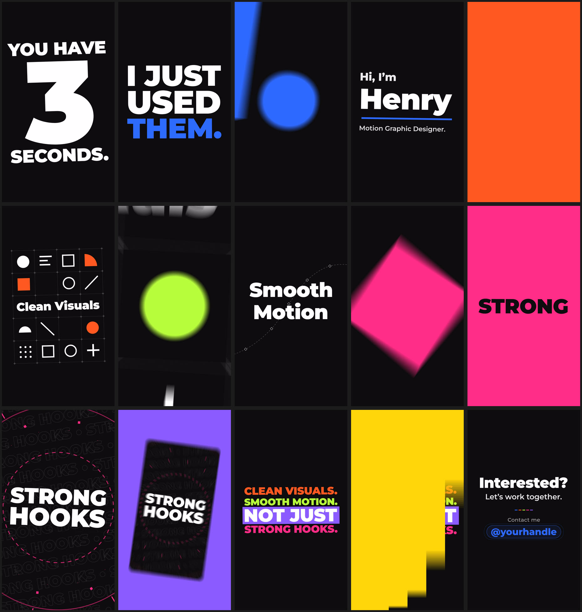

# Henry: hyper-motion intro

A 20-second vertical (9:16, 1080×1920, 60 fps) hyper-motion video introducing Henry, a motion graphic designer. It uses only typography, shapes and animation, with no footage or people. The camera never stops: every scene zooms, rotates and kicks on the beat, and every scene change goes through a full-frame transition in its own color. The message is that Henry does clean visuals and smooth motion, not just strong hooks.

The whole video, including the soundtrack, is generated from code, so you can change any timing, word or color and render again.

**Output:** [`out/henry-intro.mp4`](out/henry-intro.mp4) (H.264 + AAC, 1080×1920, 60 fps, 20.0 s)



## Style

| | |
|---|---|
| Background | `#0D0D0D` near-black |
| Text | `#FFFFFF` |
| Transition colors | One per scene change, which then becomes that scene's accent: blue `#2F6BFF`, orange `#FF5A1F`, lime `#B8FF3C`, pink `#FF2D87`, violet `#8A5CFF`, yellow `#FFD60A`. The call to action returns to brand blue. |
| Type | Montserrat Black / ExtraBold / SemiBold / Medium (geometric sans, SIL OFL) |
| Camera | Per-scene zoom and rotation: zoom dives into shapes, whip spins, zoom-outs to a card, push-ins, kick-synced zoom pulses and impact shake |
| Motion | Cubic-bezier ease-in-out curves with 3–8% overshoot; real sub-frame motion blur (180° shutter, 8 samples per frame, 16 during transitions) |
| Music | 120 BPM electronic track in F minor; every cut lands on an 8th note, with a riser into every zoom dive |

All text stays inside a 100 px side margin and between y≈350 and y≈1460, which clears the Reels, TikTok and Shorts interface. The smallest text is 50 px on the 1080 px canvas, roughly 18 pt on a phone.

## Timeline

| Time | Scene | What happens | Transition out |
|---|---|---|---|
| 0–3 s | **Hook** | "YOU / HAVE / 3 / SECONDS." slam in word by word, and the camera kicks and tilts on each hit. At 1.5 s it snaps to "I JUST / USED / THEM."; "THEM." lands on a blue flash with a bass drop. | **Blue:** the camera pans onto the full stop of "THEM." and dives into it until the frame is blue |
| 3–5.4 s | **Intro** | A dark iris opens out of the blue as the camera zooms out and unrotates. "Hi, I'm / Henry" rises letter by letter, a blue line draws under the name, and "Motion Graphic Designer." fades up. The camera keeps drifting and pulses on the kick. | **Orange:** a whip spin with a push-in while an orange band sweeps over the frame |
| 5.4–8 s | **Clean Visuals** | The camera spins in and slowly pulls back while a grid draws itself. "Clean Visuals" slides into the middle row and 14 shapes snap into their cells in mirrored pairs, one pair per 16th note. | **Lime:** one circle turns lime and the camera dives into it |
| 8–11 s | **Smooth Motion** | The camera zooms out of that circle, which turns out to be the head of a lime ribbon. The ribbon glides along an S-curve, drawn over a dashed motion path with keyframe markers, while the camera follows it. "Smooth Motion" rides in along the same path and peels off into place. | **Pink:** the camera pulls back and twists while a spinning pink square grows over the frame |
| 11–13 s | **Strong Hooks** | Quick cuts on 8th notes: "STRONG" on pink, "HOOKS" in pink, then "STRONG / HOOKS" punches in over a pink disk and scrolling outlined text. Ray bursts, rings and outline echoes fire on each beat with zoom kicks and heavy shake. | **Violet:** the camera zooms out until the scene is a small spinning card on violet |
| 13–16 s | **Recap** | A new card zooms in out of the violet. "CLEAN VISUALS." (orange), "SMOOTH MOTION." (lime), "NOT JUST" (on a violet marker) and "STRONG HOOKS." (pink) slam in one by one. The camera tracks each line, then pulls back to show the whole statement. | **Yellow:** staggered yellow bars drop over a push-in |
| 16–20 s | **Call to action** | The bars fall away and the camera settles into a calm, centred layout: "Interested?", "Let's work together.", a divider in all five section colors, "Contact me" and the handle in blue inside a pill that pulses at 18 s and 19 s. It fades to black from 19.3 s. | |

## Change the contact line

The handle is a placeholder (`@yourhandle`). To render with your own handle or email:

```bash
node render.mjs --contact "@yourname"
# or
node render.mjs --contact "you@example.com"
```

You can also change the default in `settings.contact` in [`src/scene.js`](src/scene.js). Long values shrink automatically to fit the frame.

## Render

Requires Node 18+ and `ffmpeg` on PATH.

```bash
cd henry-intro
npm install
node render.mjs                       # full quality: 60 fps, motion blur -> out/henry-intro.mp4
node render.mjs --fps 30 --samples 1  # quick draft without motion blur
node stills.mjs 2.9 4.5 7.0 15.2      # single frames -> out/stills/
```

On a 4-core machine a full render takes a few minutes. The script also writes `out/soundtrack.wav`.

## Live preview

```bash
npx serve .        # or: python3 -m http.server
# then open http://localhost:3000/preview.html (or :8000)
```

The preview draws the same scene code in real time, with a scrubber and frame stepping, and plays the audio from the rendered MP4. Add `?contact=@you` to the URL to try another handle.

## Files

```
henry-intro/
├── src/scene.js    every scene, camera, easing curve, layout and transition; drawFrame(ctx, t) is deterministic
├── src/audio.mjs   the soundtrack synthesizer (drums, bass, pads, whooshes, reverb), synced to scene.js
├── render.mjs      parallel renderer: motion-blur accumulation, x264 encoding, audio mux
├── stills.mjs      renders single frames for review
├── preview.html    browser preview with a scrubber
├── fonts/          Montserrat (SIL Open Font License, see fonts/OFL.txt)
└── out/            rendered video and storyboard
```
